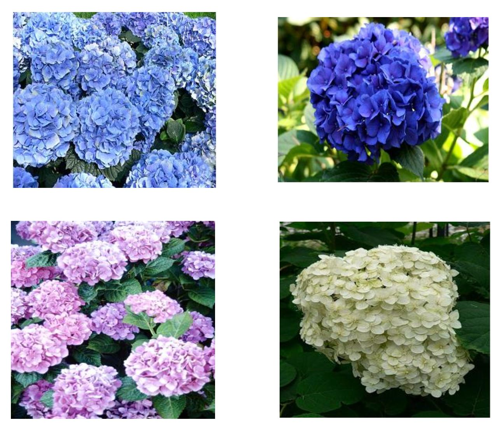
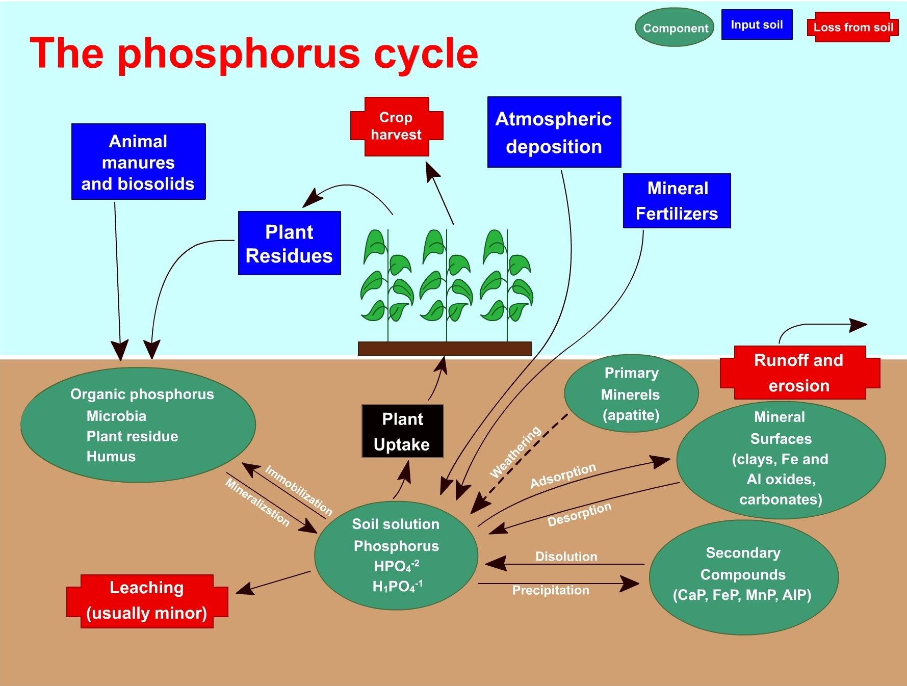

### Theory 

  <h2>Introduction</h2>
  

    A soil analysis is a process by which elements such as P, K, Ca, Mg, Na, S, Mn, Cu, and Zn are chemically extracted from the soil and measured for their <em>plant available</em> content within the soil sample.
  

  

  

 

  <h2>Significance of Soil Analysis</h2>
  <ul>
    <li>It increases the knowledge of what nutrients are especially available in a given soil.</li>
    <li>It reduces the environmental impacts due to soil amendments.</li>
    <li>It increases the efficiency of resource inputs such as fertilisers and water.</li>
    <li>It helps to predict the nutritional values needed for crop production.</li>
    <li>It helps to evaluate the fertility status of soils of a country, state, or district.</li>
  </ul>

  <h2>Procedure for Taking Good Soil Samples</h2>
  <ol>
    <li>Determine the soil unit (or plot).</li>
    <li>Make a traverse over the soil unit (or plot).</li>
    <li>Clean the site (with spade) from where soil sample is to be collected.</li>
    <li>Insert the spade into soil.</li>
    <li>Standing on the opposite side, again insert the spade into soil.</li>
    <li>A lump of soil is removed.</li>
    <li>
      A pit of ‘V’ shape is formed. Its depth should be 0–6", 0–9", or 0–12" (i.e., depth of tillage).
    </li>
    <li>
      Remove the soil-slice (like a bread slice) of ½ inch thick from both the exposed surfaces of the pit from top to bottom. This slice is also termed a furrow-slice. Use a spade to collect the soil-slice. Collect soil samples in a polyethylene bucket.
    </li>
    <li>
      Collect furrow-slices from 8–10 or sometimes 20–30 sites. Select the sites randomly in a zigzag (or criss-cross) manner and distribute throughout the soil unit (plot). Use an auger in place of a spade if needed. Avoid prohibited samples and local problem soils.
    </li>
    <li>
      Furnish the following information on two sheets of thick paper with the sample. One sheet is folded and kept inside the bag, the other is attached outside.
    </li>
  </ol>

  <h2>Hydrangeas... Blue or Pink?</h2>
  

    Hydrangeas respond to the soil pH where they are planted. They produce blue flowers in acid soil (pH 5.5 and below); if the soil is highly acidic, the flowers become the bluest of blue. Pink flowers are produced in alkaline soil (pH 7 and above); if the soil is highly alkaline, the flowers can become white, such as the variety <em>‘Lanarth White’</em>.
  

 

<h2>Available Phosphorus in Soil</h2>

  The term <strong>available phosphorus</strong> refers to the inorganic form occurring in soil solution which is almost exclusively <em>Orthophosphate</em>. This Orthophosphate occurs in several forms and combinations. The phosphate contributions in soil are governed by hydrogenous equilibria in which it takes part. This can be represented as:

  Phosphorus absorbed in soil phase ⇌ P in soil solution ⇌ Precipitated P

  The phosphorus absorbed by plants from soil comes from the soil solution in which it exists as an inorganic Orthophosphate ion: H2PO4-, HPO42-, and PO43-. The most accessible ion is H2PO4-. The quantity of phosphorus accessible to the plants is influenced by a series of soil properties.

 

<h2>Principle of Dickman and Bray’s Method</h2>

  The underlying principle of this method is that the soil is shaken with an extracting solution of 0.03 N NH₄F in 0.025 N HCl, which dissolves the fraction of phosphorus bound to roots. Ammonium fluoride complexes with Al and Fe ions in the acid solution, releasing phosphorus held by the soil through these trivalent ions. Thus, the combination of HCl and NH₄F helps remove easily acid-soluble forms of phosphorus, largely calcium phosphates and a portion of aluminium and iron phosphates.

The reactions in acid solution may be represented as follows:

<pre>
3 NH₄F + 3 HF + AlPO₄ → H₃PO₄ + (NH₄)₃AlF₆
3 NH₄F + 3 HF + FePO₄ → H₃PO₄ + (NH₄)₃FeF₆
</pre>

  In the above reactions, AlPO₄ and FePO₄ represent various hydrated and hydroxyl phosphates of Al and Fe, including any absorbed or precipitated surface layers on oxides of Al, aluminosilicates, and oxides of Fe.

  HCl causes the dissociation of more active calcium phosphate and also prevents the re-precipitation of phosphorus (as calcium phosphate) which has been dissolved by ammonium fluoride.

  In the filtered extract, phosphorus is estimated colorimetrically by adding ammonium molybdate and then reducing the molybdenum phosphate complexes with stannous chloride in an acidic medium. A heteropoly complex (phosphomolybdate) is formed by coordination of molybdate ions with phosphorus as the central coordinating atom; the oxygen of the molybdate is substituted for that of PO₄.

The reaction may be represented as:

<pre>
H₃PO₄ + 12 H₂MoO₄ → H₃P(Mo₃O₁₀)₄ + 2 H₂O
</pre>

  These heteropoly complexes give a yellow colour in solution before reduction. In low-phosphorus concentration solutions, the molybdate is partially reduced to form a characteristic blue colour. The intensity of this colour, which is proportional to the phosphorus concentration, is measured using a colorimeter.

<h3>Significance</h3>

<ul>
  <li>The availability of phosphorus is a good indicator of the soil’s phosphorus supplying capacity.</li>
  <li>Knowledge of available phosphorus content helps determine the critical limit based on soil-test-crop response studies.</li>
  <li>Evaluation of a soil's critical phosphorus limit aids in developing phosphorus fertility classes for effective fertilizer recommendations.</li>
</ul>

